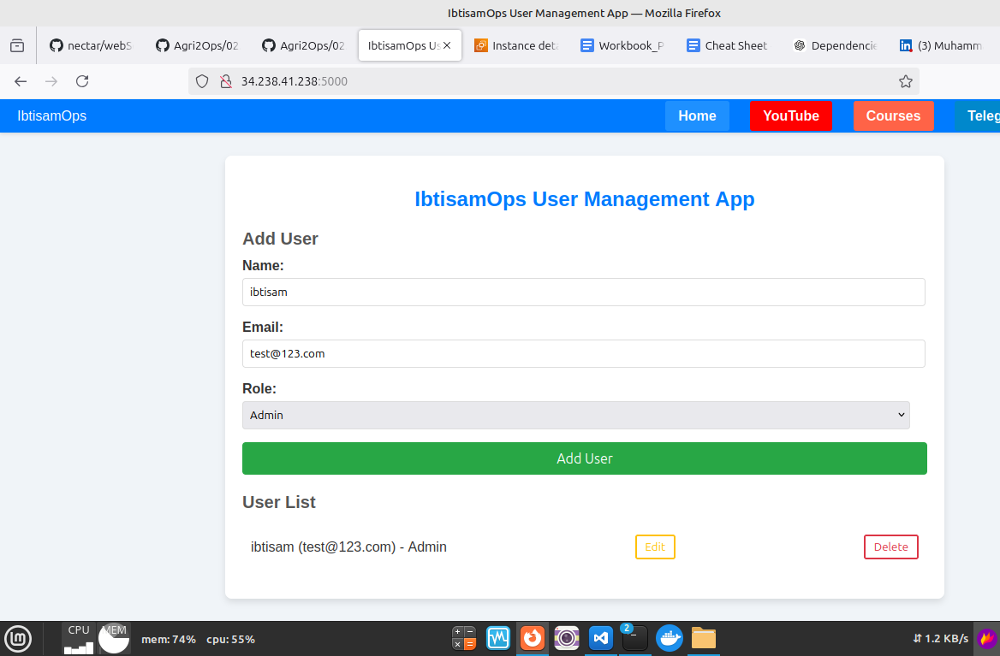

# React Node 3-Tier User Management App

This is a full-stack application for managing users with a front-end built using HTML, CSS, and JavaScript, and a back-end powered by Node.js, Express, and MySQL.

## Database Configuration

`server/config/db.js`

## Complete README

Please see the [README.md](https://github.com/ibtisam-iq/3TierUserApp-ReactNode-MySQL/blob/main/README.md) file for a detailed description of the project.

## Project Structure

Please refer to [consoleOutput.txt](https://github.com/ibtisam-iq/3TierUserApp-ReactNode-MySQL/blob/main/consoleOutput.txt) for more details. 😊

## Project Snapshot

