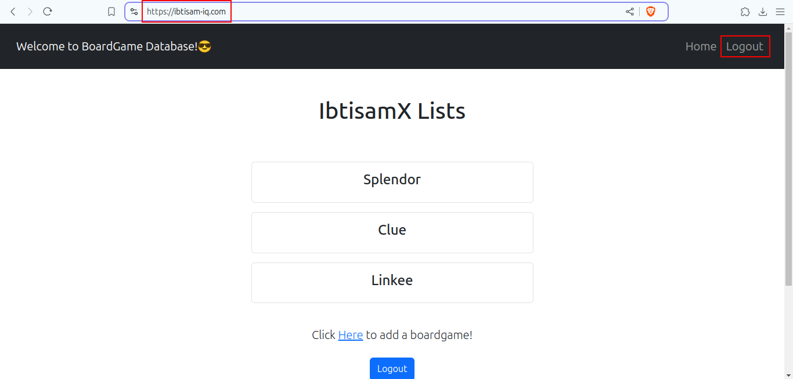

# BoardGameDB-Java-H2

## Description

**Board Game Database Full-Stack Web Application.**
This web application displays lists of board games and their reviews. While anyone can view the board game lists and reviews, they are required to log in to add/ edit the board games and their reviews. The 'users' have the authority to add board games to the list and add reviews, and the 'managers' have the authority to edit/ delete the reviews on top of the authorities of users.

## How to Run

1. Clone the repository
2. Open the project in your IDE of choice
3. Run the application
4. To use initial user data, use the following credentials.
  - username: **ibtisam**      |     password: **123** (user role)
  - username: **ibtisam-iq**   |     password: **12345**  (manager role)
5. You can also sign-up as a new user and customize your role to play with the application!

## Complete README

Please see the [README.md](https://github.com/ibtisam-iq/JavaBoardGameDB-H2/blob/main/README.md) file for a detailed description of the project.

## Project Structure

Please refer to [consoleOutput.txt](https://github.com/ibtisam-iq/JavaBoardGameDB-H2/blob/main/consoleOutput.txt) for more details. 😊

## Project Snapshot

