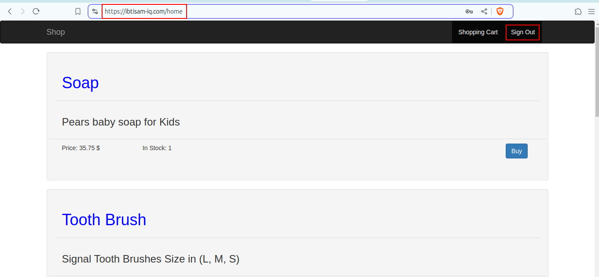

# Spring Boot Shopping Cart Web App

## About

This is a demo project for practicing Spring + Thymeleaf. The idea was to build some basic shopping cart web app.

It was made using **Spring Boot**, **Spring Security**, **Thymeleaf**, **Spring Data JPA**, **Spring Data REST**. 
Database is in memory **H2**.

There is a login and registration functionality included.

Users can shop for products. Each user has his own shopping cart (session functionality).
Checkout is transactional.

## How to run

Go to the root folder of the application and type:

```bash
sudo apt-get install openjdk-8-jdk
mvn package -DskipTests=true
```
- It will take some time to be online.
`http://localhost:3395/home`

# Docker Images

```bash
ibtisam@mint-dell:~/SilverOps/DevOps/DevOps-Tools/docker/02-JavaEkartWebApp$ docker images
REPOSITORY                         TAG                  IMAGE ID       CREATED          SIZE
multi-stage-with-maven-prebuilt    latest               d43298c1175e   10 minutes ago   343MB
single-stage-with-maven-prebuilt   latest               51b2da9f42fd   23 minutes ago   329MB
```
## Complete README

Please see the [README.md](https://github.com/ibtisam-iq/JavaEkartApp-H2/blob/main/README.md) file for a detailed description of the project.


## Project Structure

Please refer to [consoleOutput.txt](https://github.com/ibtisam-iq/JavaEkartApp-H2/blob/main/consoleOutput.txt) for more details. 😊

## Project Snapshot

