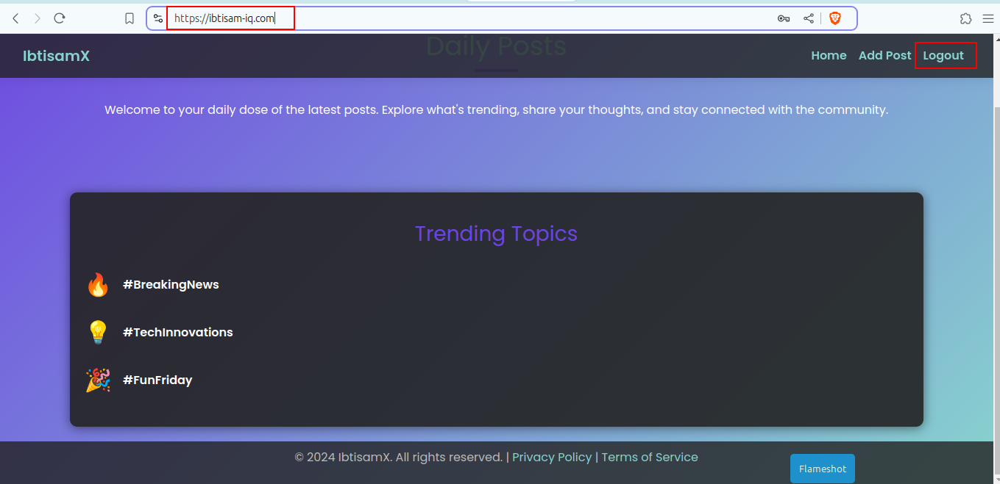

# 3 Tier Java Blogging Application 

## Project Structure

Please refer to `consoleOutput.txt` for more details. 😊

## Docker Images

```bash
ibtisam@mint-dell:~/SilverOps/DevOps/DevOps-Tools/docker/02-JavaEkartWebApp$ docker images
REPOSITORY                                 TAG                  IMAGE ID       CREATED             SIZE
multi-build-blogapp                        latest               792b2ead4996   39 seconds ago      378MB
single-build-blogapp-with-maven-prebuilt   latest               cac44b3d6b98   About an hour ago   498MB
single-build-blogapp-with-openjdk          latest               9c18bd4d3986   About an hour ago   838MB
```

## Project Snapshot

