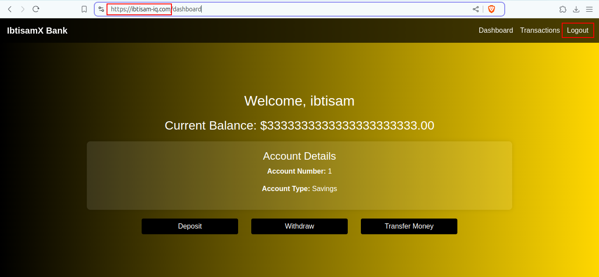

# 2 Tier Spring Boot Bank App with MySQL

## Overview
This project is a Java-based banking application that follows a 2-tier architecture, utilizing a MySQL database.

## Complete Project

Please see the [Complete Project](https://github.com/ibtisam-iq/BankingApp-Java-MySQL/blob/main/README.md) for in-depth analysis.

## Project Insights

Please refer to [insights](https://github.com/ibtisam-iq/BankingApp-Java-MySQL/tree/main/insights) for more details. 😊

## Project Snapshot

