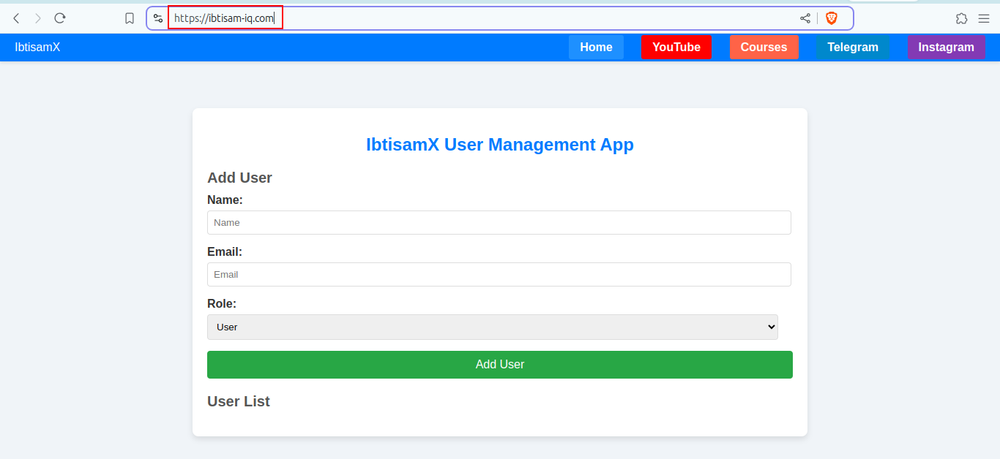

# React Node 3-Tier User Management App

This is a full-stack application for managing users with a front-end built using HTML, CSS, and JavaScript, and a back-end powered by Node.js, Express, and MySQL.

## Database Configuration

`server/config/db.js`

## Complete README

Please see the [Complete Project](https://github.com/ibtisam-iq/3TierUserApp-ReactNode-MySQL/) file in-depth details.


## Project Structure

Please refer to [insights](https://github.com/ibtisam-iq/3TierUserApp-ReactNode-MySQL/tree/main/insights) for more details. 😊

## Docker Images

```bash
ibtisam@mint-dell:~/SilverOps/DevOps/DevOps-Tools/docker/07-UserApp-ReactNode-MySQL-3Tier/client$ docker images
REPOSITORY                                                                             TAG                  IMAGE ID       CREATED          SIZE
userapp-client-multi-stage-build-with-nginx-reverse-proxy---frontend-and-api-gateway   latest               9581aa45f5db   12 minutes ago   48.1MB
userapp-server-multi-stage-build                                                       latest               5b2ab32bcf5f   14 minutes ago   137MB

```


## Project Snapshot

