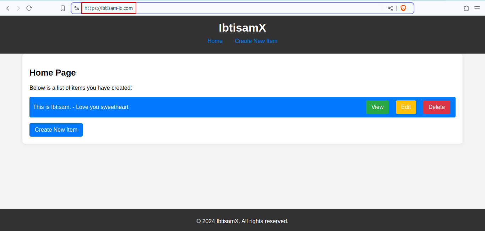

# 3-Tier Python + PostgreSQL Application

This project is a 3-tier web application built using Python for the backend, with PostgreSQL as the database. The application consists of a presentation layer, a business logic layer, and a data access layer.

## Complete README

Please see the [README.md](https://github.com/ibtisam-iq/3TierFullStackApp-Flask-Postgres/blob/main/README.md) file for a detailed description of the project.


## Project Structure

Please refer to [consoleOutput.txt](https://github.com/ibtisam-iq/3TierFullStackApp-Flask-Postgres/blob/main/consoleOutput.txt) for more details. 😊

## Docker Image

```bash
ibtisam@mint-dell:~/SilverOps/DevOps/DevOps-Tools/docker/08-FullStackApp-Flask-Postgres$ docker images
REPOSITORY                                                                             TAG                  IMAGE ID       CREATED              SIZE
multi-build-with-venv                                                                  latest               aae57dd7c04e   About a minute ago   172MB
multi-build-no-venv                                                                    latest               74cfdb0808ff   7 minutes ago        171MB
single-build-no-venv                                                                   latest               a57cb33534f9   29 minutes ago       165MB
```

## Project Snapshot
