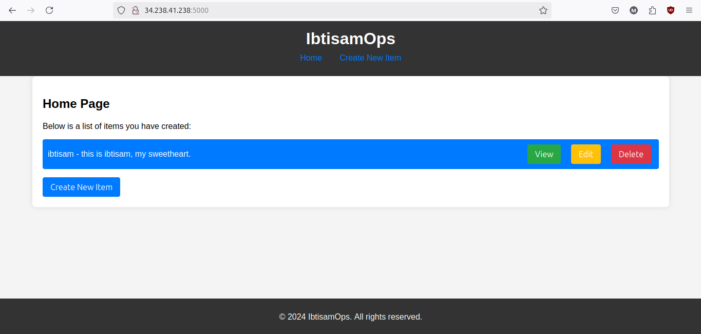

# 3-Tier Python + PostgreSQL Application

This project is a 3-tier web application built using Python for the backend, with PostgreSQL as the database. The application consists of a presentation layer, a business logic layer, and a data access layer.

## Complete README

Please see the [README.md](https://github.com/ibtisamops/3TierFullStackApp-Flask-Postgres/blob/main/README.md) file for a detailed description of the project.

## Project Structure

Please refer to [consoleOutput.txt](https://github.com/ibtisamops/3TierFullStackApp-Flask-Postgres/blob/main/consoleOutput.txt) for more details. 😊

## Project Snapshot
