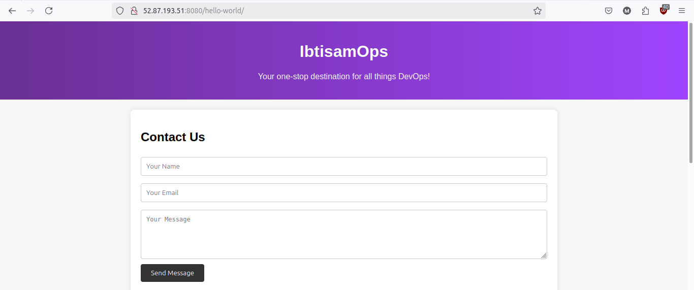

# Tomcat Web App

## Overview

This is a simple web application built using the Tomcat server. It consists of a single servlet that handles HTTP requests and responds with a simple "Hello World!" message. 

The application is deployed as a WAR file, which is a standard format for Java web applications. The WAR file is then deployed to a Tomcat server using Jenkins, where it can be accessed via a web browser. 

The context path of the application is set to `/hello-world`, which means that the application can be accessed at the URL `http://localhost:8080//hello-world`.

## Complete README

Please see the [README.md](https://github.com/ibtisamops/TomcatWebApp/blob/main/README.md) file for a detailed description of the project.

## Project Structure

Please refer to [consoleOutput.txt](https://github.com/ibtisamops/TomcatWebApp/blob/main/consoleOutput.txt) for more details. 😊

## Project Snapshot

